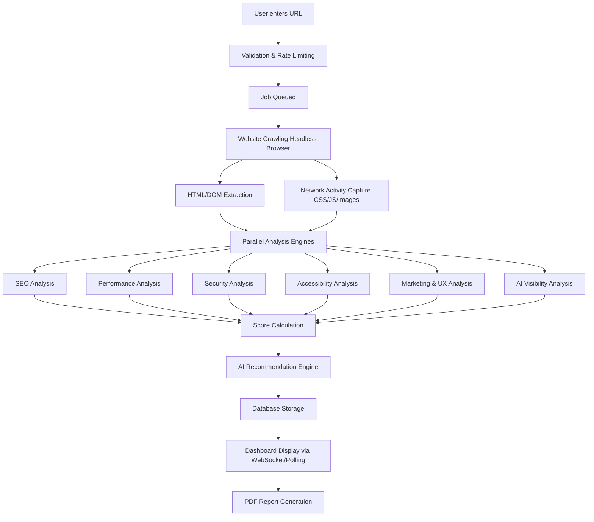

# Website Auditor: Complete Technical Blueprint & Implementation Guide

> [!IMPORTANT]
> This document serves as the master blueprint for building a production-ready Website Auditor capable of competing with industry leaders like Google PageSpeed Insights, Semrush, and Ahrefs.

---

## 1. Software Requirements Specification (SRS)

### Project Overview
Website Auditor is an advanced, AI-powered SaaS platform that performs comprehensive analysis of public websites. It evaluates a given URL across multiple dimensions (SEO, Performance, Security, Accessibility, UX, Marketing, AI Visibility) to generate a detailed, actionable report with an aggregate score.

### Business Objective
To provide businesses, marketers, and developers with an all-in-one, automated auditing tool that identifies technical issues, suggests actionable fixes, and provides AI-driven insights to improve search visibility, conversion rates, and user experience.

### User Requirements
- Enter a public URL to trigger an audit.
- View a real-time progress indicator during the scan.
- Receive a final score out of 100 with category-specific breakdowns.
- Download a branded, professional PDF report.
- View a historical dashboard of past audits and track progress over time.

### Functional Requirements
- **Web Crawler:** Ability to fetch HTML, CSS, JS, and execute dynamic content via headless browsers.
- **Analysis Engine:** Run predefined rule-based checks across 7 major categories.
- **Reporting System:** Generate visualizations, prioritize issues (High/Medium/Low), and export to PDF/Excel.
- **User Authentication:** Secure signup/login (OAuth/JWT) to save history.
- **AI Integration:** Use LLMs to explain complex issues and suggest custom code fixes.

### Non-Functional Requirements
- **Performance:** Audits must complete within 30-60 seconds.
- **Scalability:** System must handle concurrent audits via background job queues.
- **Availability:** 99.9% uptime.
- **Security:** Secure handling of user data, rate limiting to prevent abuse, and secure API endpoints.

### System Architecture & Data Flow
1. **Client (Web/Mobile):** Sends a URL audit request to the API Gateway.
2. **API Gateway (FastAPI):** Validates the request, checks rate limits, and pushes a job to the Queue.
3. **Queue (RabbitMQ/Redis):** Holds the pending audit jobs.
4. **Worker Nodes (Python/Playwright):** Pick up jobs, crawl the website, extract DOM/Network data, and run analysis modules.
5. **AI Service:** Queries LLM (Gemini/OpenAI) for issue explanations and fixes.
6. **Database (MongoDB):** Stores the raw data, computed scores, and final report.
7. **Client:** Polls or receives WebSocket events for real-time progress and final results.

---

## 2. Complete Website Audit Workflow



**Workflow Details:**
1. **Validation:** Ensure the URL is valid, public, and user hasn't exceeded limits.
2. **Crawling:** Use a tool like Playwright to render JS-heavy sites (CSR) just like a real browser.
3. **Extraction:** Parse the DOM (using BeautifulSoup or Cheerio) and intercept network requests.
4. **Analysis:** Run specialized modules in parallel to evaluate the extracted data against standard rules.
5. **AI Processing:** Pass critical failures to an LLM to generate plain-English explanations.
6. **Scoring:** Aggregate weighted category scores into a final 0-100 metric.

---

## 3. Audit Categories

### 3.1 SEO (Search Engine Optimization)
*   **Title Tag & Meta Description:** 
    *   *Why:* Crucial for SERP CTR. 
    *   *Detect:* Parse `<title>` and `<meta name="description">`. 
    *   *Fix:* Ensure Title is 50-60 chars, Description is 150-160 chars.
*   **H1-H6 Structure:** Ensure exactly one H1, logically followed by H2s, H3s.
*   **Canonical URL:** Check for `<link rel="canonical">` to prevent duplicate content penalties.
*   **Robots.txt & Sitemap.xml:** Verify these files exist at `/robots.txt` and `/sitemap.xml`.
*   **Image ALT Tags:** Find all `` without `alt` attributes. *Fix:* Add descriptive alt text.
*   **Broken Links (404s):** Extract all `<a>` tags and ping them asynchronously.
*   **Structured Data / Schema.org:** Extract JSON-LD scripts and validate structure.

### 3.2 Performance
*   **Core Web Vitals (LCP, FCP, TTI, CLS):** 
    *   *Detect:* Use Google Lighthouse CLI or Playwright performance APIs.
    *   *Why:* Direct Google ranking factor.
*   **Image Optimization:** Detect heavy images (> 500KB) and suggest WebP/AVIF formats.
*   **Minification & Compression:** Check headers for `Content-Encoding: gzip/br` and inspect JS/CSS for minification.
*   **Browser Cache & CDN:** Check `Cache-Control` headers and known CDN IPs/Headers (Cloudflare, AWS).

### 3.3 Security
*   **HTTPS/SSL:** Verify protocol is `https://` and SSL certificate is valid/not expiring soon.
*   **Mixed Content:** Detect HTTP resources loaded on an HTTPS page.
*   **Security Headers:** Check for `Strict-Transport-Security` (HSTS), `Content-Security-Policy` (CSP), `X-Frame-Options` (Clickjacking protection), and `X-Content-Type-Options`.

### 3.4 Accessibility (a11y)
*   **Color Contrast:** Compute contrast ratio between text and background (WCAG AA requires 4.5:1).
*   **ARIA Attributes:** Check for valid `aria-*` tags for screen readers.
*   **Keyboard Navigation:** Ensure interactive elements (buttons, links) have `tabindex` and focus states.
*   **Semantic HTML:** Favor `<nav>`, `<main>`, `<article>`, `<footer>` over generic `<div>`s.

### 3.5 User Experience (UX)
*   **Responsive Design:** Check viewport meta tag `<meta name="viewport">` and use Playwright to test mobile layouts (CSS media queries).
*   **Tap Targets:** Ensure buttons are at least 48x48 pixels on mobile to prevent "fat finger" clicks.

### 3.6 Marketing
*   *Detect:* Parse HTML/JS for known patterns (e.g., `gtag`, `fbq`, `hj`).
*   *Checks:* Google Analytics, Meta/Facebook Pixel, Tag Manager, Hotjar.
*   *Why:* Essential for retargeting, conversion tracking, and audience insights.

### 3.7 AI Visibility (Modern SEO)
*   *Why:* Optimizing for LLMs (ChatGPT, Gemini, Perplexity) instead of traditional search engines (GEO - Generative Engine Optimization).
*   *Checks:*
    *   **Knowledge Graph Readiness:** Presence of Organization/LocalBusiness Schema.
    *   **Direct Answers:** Presence of FAQ Schema and clear, concise Q&A formatting.
    *   **Semantic Density:** Use of highly relevant entities and clear `<section>` boundaries.
    *   **Bot Access:** Ensure `robots.txt` does not block AI crawlers (like `GPTBot` or `Google-Extended`) unless intended.

---

## 4. Website Crawling

**How it works:**
1.  **Resolution:** Resolve the domain and fetch `robots.txt` to respect `Disallow` rules and find the `Sitemap`.
2.  **Rendering:** Modern sites use React/Vue (CSR - Client Side Rendering). Simple HTTP requests (like `requests.get`) return blank pages. We must use a Headless Browser (Playwright/Puppeteer) to execute JavaScript and wait for the DOM to settle (Dynamic Rendering).
3.  **Strategies:**
    *   *Depth-First:* Dive deep into one category link before moving to another. Good for finding deep broken links.
    *   *Breadth-First:* Crawl all top-level pages first. Best for general site audits.
4.  **Rate Limiting:** Professional crawlers pause between requests (e.g., 500ms) to avoid DDoSing the target server and getting IP-banned.

---

## 5. Tech Stack Recommendation

*   **Frontend:** **Angular** or **Next.js (React)**. Angular for enterprise-grade structure; Next.js for SSR and SEO-friendly marketing pages. (Assume Angular based on current repo).
*   **Backend:** **FastAPI (Python)**. Extremely fast, native async support (vital for I/O bound crawling), and seamless integration with Python's data/AI ecosystems.
*   **Database:** **MongoDB**. JSON-like document store is perfect for storing highly variable, nested audit reports.
*   **Queue/Workers:** **Celery + Redis** or **RabbitMQ**. Handles background crawling so API doesn't timeout.
*   **Crawling Engine:** **Playwright (Python)**. Superior to Puppeteer, handles multiple browser engines natively.
*   **Deployment:** **Docker** (containerization), **Nginx** (Reverse Proxy), **GitHub Actions** (CI/CD), hosted on **AWS/GCP/Railway/Render**.

---

## 6. API Design

*   `POST /api/v1/audits` - Start a new audit. Body: `{"url": "https://example.com"}`. Returns `{"job_id": "123"}`.
*   `GET /api/v1/audits/{job_id}/status` - Poll for progress (0-100%).
*   `GET /api/v1/audits/{job_id}/report` - Retrieve full JSON report data.
*   `GET /api/v1/audits/{job_id}/export/pdf` - Download generated PDF.
*   `GET /api/v1/users/history` - List past audits for authenticated user.
*   `POST /api/v1/auth/register` & `POST /api/v1/auth/login` - JWT Authentication.

---

## 7. Database Design (MongoDB Schema)

**Collection: `Users`**
- `_id`: ObjectId
- `email`: String (Index)
- `hashed_password`: String
- `created_at`: Date

**Collection: `Audits`**
- `_id`: ObjectId
- `user_id`: ObjectId (Ref Users)
- `url`: String (Index)
- `status`: String (pending, scanning, completed, failed)
- `created_at`: Date
- `scores`: Object `{ overall: 85, seo: 90, performance: 70, security: 100, ... }`
- `metrics`: Object (Raw data for LCP, FCP, etc.)
- `issues`: Array of Objects:
  ```json
  [
    {
      "category": "seo",
      "severity": "high",
      "title": "Missing H1 Tag",
      "description": "The page has no H1 tag.",
      "how_to_fix": "Add exactly one <h1> tag to your main content.",
      "ai_explanation": "An H1 tag tells search engines..."
    }
  ]
  ```

---

## 8. AI Features

1.  **Natural Language Explanations:** Instead of generic text, pass the specific page context to Gemini/OpenAI: *"Explain why this specific React codebase is causing a high Cumulative Layout Shift and how to fix it."*
2.  **Code Snippet Generation:** AI generates exact code diffs (e.g., adding `width` and `height` attributes to an `` tag it found).
3.  **Competitor Insights:** AI summarizes how the target site's content strategy compares to top-ranking sites.

---

## 9. Scoring System

**Algorithm:**
1.  **Weighting:** Performance (30%), SEO (30%), Accessibility (15%), Security (15%), UX/Marketing (10%).
2.  **Thresholds:**
    *   *High Severity Issue:* -10 points.
    *   *Medium Severity Issue:* -5 points.
    *   *Low Severity Issue:* -2 points.
3.  **Calculation:**
    `Category Score = 100 - (High * 10) - (Medium * 5) - (Low * 2)`
    `Overall Score = (Perf * 0.3) + (SEO * 0.3) + ...`
    Ensure minimum score is 0.

---

## 10. Competitor Comparison

| Feature | PageSpeed Insights | Semrush/Ahrefs | SEOptimer | **Our Website Auditor** |
| :--- | :---: | :---: | :---: | :---: |
| **Focus** | Performance only | Heavy SEO | General Audit | **Full Stack (Perf, SEO, Sec, AI)** |
| **AI Insights**| No | Limited | No | **Core Feature (Custom fixes)** |
| **Marketing Stack**| No | No | Yes | **Deep Stack Detection** |
| **AI Visibility (GEO)**| No | No | No | **Exclusive Feature** |

*How we win:* By combining Lighthouse performance data, deep SEO crawling, marketing pixel detection, and **AI-driven actionable fixes** into one unified, beautiful dashboard.

---

## 11. Dashboard & UI Implementation

**Frontend Component Hierarchy (Angular):**
- `AppModule`
  - `HeaderComponent` (Navigation, Auth)
  - `DashboardComponent` (History List, Trend Graphs using Chart.js)
  - `AuditInputComponent` (Hero section, URL input, Loading state)
  - `ReportViewComponent`
    - `ScoreRingComponent` (Circular progress bars for scores)
    - `CategoryTabsComponent` (SEO, Perf, Sec...)
    - `IssueListComponent` (Expandable accordion for each issue)
      - `AIExplanationComponent` (Markdown rendered AI suggestions)

---

## 12. Folder Structure

```text
website-auditor/
├── backend/                  # FastAPI Application
│   ├── app/
│   │   ├── api/              # Route handlers (auth.py, audits.py)
│   │   ├── core/             # Config, security, database connection
│   │   ├── models/           # Pydantic/Beanie models
│   │   ├── services/         # Business logic (Crawler, Scorer, AI Agent)
│   │   │   ├── analyzer/     # SEO, Perf, Security modules
│   │   │   ├── ai/           # LLM integration
│   │   │   └── report/       # PDF generation (ReportLab)
│   │   └── worker/           # Celery background tasks
│   ├── tests/
│   ├── requirements.txt
│   └── Dockerfile
├── frontend/                 # Angular Application
│   ├── src/
│   │   ├── app/
│   │   │   ├── core/         # Interceptors, Auth Guards, Services
│   │   │   ├── shared/       # Reusable components (Buttons, Loaders)
│   │   │   ├── pages/        # Route components (Home, Dashboard, Report)
│   │   │   └── assets/       # Images, styles, fonts
│   ├── package.json
│   └── Dockerfile
├── docker-compose.yml        # Local dev environment
└── .github/                  # CI/CD workflows
```

---

## 13. Deployment Architecture

1.  **Dockerization:** Both Frontend and Backend are containerized. Backend base image must include Playwright dependencies (WebKit, Chromium, Firefox).
2.  **Cloud Hosting:**
    *   *Backend:* Railway, Render, or AWS ECS. Needs high RAM for headless browsers.
    *   *Frontend:* Vercel, Netlify, or AWS S3 + CloudFront (for Angular static build).
    *   *Database:* MongoDB Atlas (Serverless or Dedicated).
3.  **Reverse Proxy/Nginx:** Handles SSL termination and routes `/api` requests to backend and `/` to frontend if hosted on the same server.
4.  **Monitoring:** Sentry for error tracking (frontend and backend).

---

## 14. Final Deliverables & Roadmap

### Development Phases
1.  **Phase 1 (MVP):** Basic API, simple Playwright crawler, SEO/Security checks, simple UI, score calculation.
2.  **Phase 2 (Pro):** Background Queues (Celery), Authentication, Database history, PDF generation.
3.  **Phase 3 (Enterprise):** AI recommendations, Performance APIs (Lighthouse), Advanced Dashboard, Payment Gateway (Stripe).

### Interview Q&A Cheatsheet
*   **Q: Why FastAPI?**
    *   A: Python is the standard for AI/Data tools, and FastAPI provides asynchronous event loops out of the box, which is mandatory when executing thousands of parallel network requests and headless browser tasks without blocking.
*   **Q: How do you handle crawling SPAs (Single Page Apps)?**
    *   A: Standard HTTP requests fail on SPAs. We use Playwright to launch a headless Chromium instance, wait for the network to become idle (ensuring JS executes and DOM paints), and then extract the fully rendered HTML.
*   **Q: How do you make the scan fast?**
    *   A: By parallelizing the analysis engines. While Playwright fetches the page, we run SSL/Header checks concurrently. We also use background job queues (Redis) so the API gateway is never blocked.

> [!TIP]
> This blueprint provides a master plan. Implement features iteratively, focusing on stability and accuracy of the auditing engine before adding AI bells and whistles.
